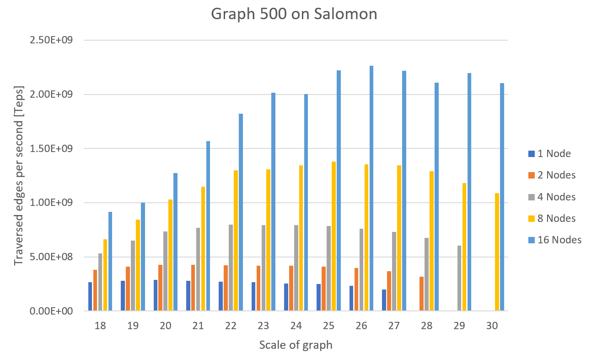

# Graph500 benchmark scripts
This repository contains scripts for running [Graph500-3.0.0 benchmark](https://github.com/graph500/graph500/releases/tag/graph500-3.0.0) on [Salomon cluster](https://docs.it4i.cz/salomon/hardware-overview/).
Each Salomon node contains 2 x Intel Xeon E5-2680v3 processors and 128GB DDR4 RAM.
Benchmark is available on Salomon cluster as easybuild module and was compiled by Intel 2018 compiler.

## Use instructions

1. To run benchark use submit script, this script will run many instances of Graph500 benchmark for selected settings
```
sh submit_graph500_benchmark.sh
```

2. To process results to one file "graph500_experiment_results.log" use following script 
```
sh process_results.sh
```

3. For cleaning all results
```
sh clean_results.sh
```

## Experiments results for Salomon cluster on CPUs



nodes | mpi_procs | problem_size | median_teps | total_time
------------- |-------------|-------------|------------- |-------------
1 | 16 | 18 | 2.68897e+08 | 3.1066552
1 | 16 | 19 | 2.78643e+08 | 6.3178904
1 | 16 | 20 | 2.86453e+08 | 8.324691
1 | 16 | 21 | 2.80537e+08 | 12.782082
1 | 16 | 22 | 2.69754e+08 | 21.597900
1 | 16 | 23 | 2.66285e+08 | 39.274516
1 | 16 | 24 | 2.55522e+08 | 82.75382
1 | 16 | 25 | 2.50261e+08 | 170.58064
1 | 16 | 26 | 2.32641e+08 | 367.30552
1 | 16 | 27 | 2.00438e+08 | 838.8746
1 | 16 | 28 | ERROR | ERROR(low RAM)
1 | 16 | 29 | ERROR | ERROR
1 | 16 | 30 | ERROR | ERROR
2 | 32 | 18 | 3.80914e+08 | 2.8417226
2 | 32 | 19 | 4.10541e+08 | 5.7270192
2 | 32 | 20 | 4.25392e+08 | 7.0962656
2 | 32 | 21 | 4.25866e+08 | 10.0954602
2 | 32 | 22 | 4.21917e+08 | 15.564616
2 | 32 | 23 | 4.20318e+08 | 26.364836
2 | 32 | 24 | 4.17655e+08 | 48.928418
2 | 32 | 25 | 4.11677e+08 | 99.97257
2 | 32 | 26 | 3.96061e+08 | 209.01848
2 | 32 | 27 | 3.67773e+08 | 449.41270
2 | 32 | 28 | 3.16056e+08 | 1027.8212
2 | 32 | 29 | ERROR | ERROR
2 | 32 | 30 | ERROR | ERROR
4 | 64 | 18 | 5.34335e+08 | 2.59554996
4 | 64 | 19 | 6.51972e+08 | 5.1646080
4 | 64 | 20 | 7.35267e+08 | 5.9411932
4 | 64 | 21 | 7.66809e+08 | 7.7382342
4 | 64 | 22 | 7.96073e+08 | 10.5907694
4 | 64 | 23 | 7.93904e+08 | 16.393561
4 | 64 | 24 | 7.9249e+08 | 27.927568
4 | 64 | 25 | 7.84437e+08 | 51.650108
4 | 64 | 26 | 7.59361e+08 | 107.41450
4 | 64 | 27 | 7.32201e+08 | 224.18272
4 | 64 | 28 | 6.74964e+08 | 484.53350
4 | 64 | 29 | 6.03802e+08 | 1075.7966
4 | 64 | 30 | ERROR | ERROR
8 | 128 | 18 | 6.64464e+08 | 2.51261916
8 | 128 | 19 | 8.44376e+08 | 5.0429742
8 | 128 | 20 | 1.02846e+09 | 5.4975212
8 | 128 | 21 | 1.14684e+09 | 6.753787
8 | 128 | 22 | 1.30148e+09 | 8.4746962
8 | 128 | 23 | 1.30976e+09 | 12.353600
8 | 128 | 24 | 1.34657e+09 | 18.846416
8 | 128 | 25 | 1.38059e+09 | 31.518528
8 | 128 | 26 | 1.35556e+09 | 58.822526
8 | 128 | 27 | 1.34447e+09 | 119.76272
8 | 128 | 28 | 1.29215e+09 | 252.75726
8 | 128 | 29 | 1.18314e+09 | 547.87050
8 | 128 | 30 | 1.09044e+09 | 1178.0161
16 | 256 | 18 | 9.16317e+08 | 2.40147204
16 | 256 | 19 | 1.00073e+09 | 4.81823616
16 | 256 | 20 | 1.27267e+09 | 5.2754236
16 | 256 | 21 | 1.56934e+09 | 6.2820312
16 | 256 | 22 | 1.81998e+09 | 7.5519474
16 | 256 | 23 | 2.01493e+09 | 10.0623724
16 | 256 | 24 | 2.00247e+09 | 14.811938
16 | 256 | 25 | 2.22344e+09 | 21.768842
16 | 256 | 26 | 2.26355e+09 | 37.348944
16 | 256 | 27 | 2.21838e+09 | 70.184828
16 | 256 | 28 | 2.11039e+09 | 148.38234
16 | 256 | 29 | 2.19704e+09 | 290.88898
16 | 256 | 30 | 2.10281e+09 | 607.33282